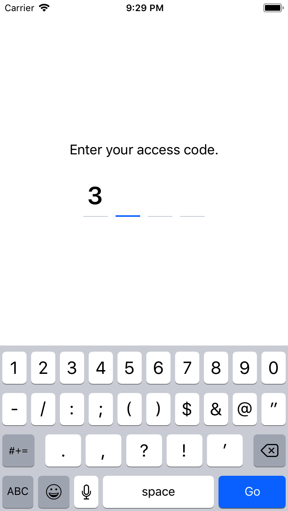

# React Native Keycode

Show the user a input form for a fixed-length code or password.

<table><tr><td>
    
</td></tr></table>


## Installation

```
npm i -S react-native-keycode         # or: yarn add react-native-keycode
```


## Usage

```
// import statement:
import { KeycodeInput } from 'react-native-keycode'

// in your render function:
<KeycodeInput
  onComplete={(value) => {
    alert(value)
  }}
/>
```

### Complete example
View a more complex example here: [example/App.js](example/App.js).

### Props
* number `length`: number of characters in input (default: 4)
* string `tintColor`: color string for the color of the active character bar (default: iOS blue)
* string `defaultValue`: default ''
* string `value`: default ''
* boolean `numberic`: default false
* boolean `autoFocus`: default true
* object `style`
* function `onComplete`
* function `onChange`
* function `ref`


## Authors

This library is developed by [Includable](https://includable.com/), a creative app and web platform
development agency based in Amsterdam, The Netherlands.

* Thomas Schoffelen, [@tschoffelen](https://twitter.com/tschoffelen)
